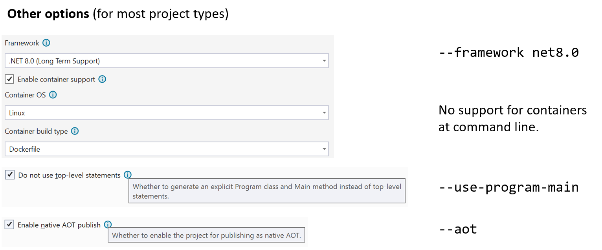
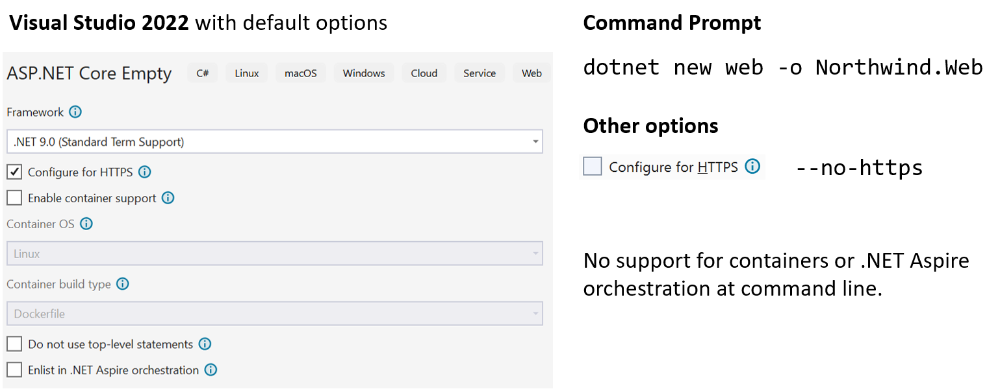
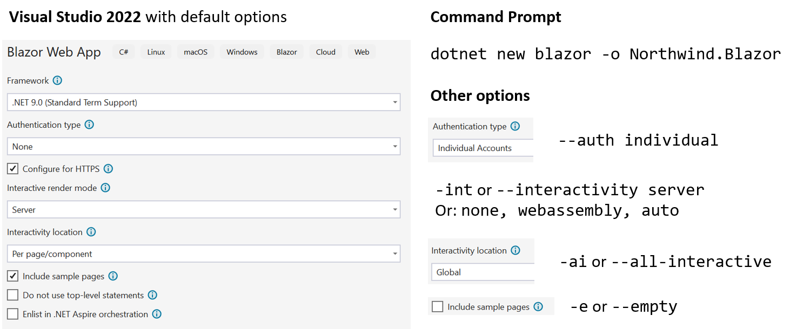
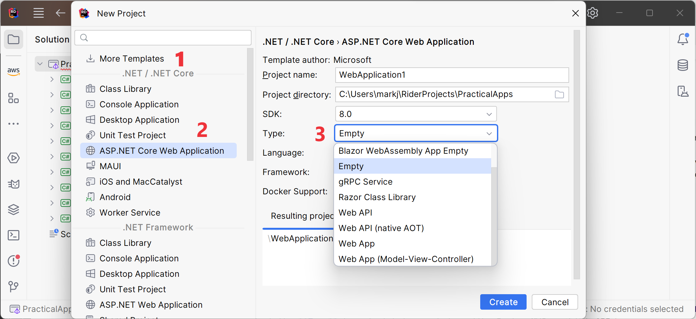

**Project Options**

When creating new project either using Visual Studio or using the command prompt for tools like VS Code, it is useful to see a summary of your options for common types of project template.

- [Console App / `console`](#console-app--console)
- [Class Library / `classlib`](#class-library--classlib)
- [ASP.NET Core Empty / `web`](#aspnet-core-empty--web)
- [ASP.NET Core Web App (Model-View-Controller) / `mvc`](#aspnet-core-web-app-model-view-controller--mvc)
- [ASP.NET Core Web API / `webapi`](#aspnet-core-web-api--webapi)
- [ASP.NET Core Web API (native AOT) / `webapiaot`](#aspnet-core-web-api-native-aot--webapiaot)
- [Blazor Web App / `blazor`](#blazor-web-app--blazor)
- [JetBrains Rider options](#jetbrains-rider-options)

# Console App / `console`

> All project templates share the same first screen to configure names for your project and solution and the location in the filesystem so that screenshot will not be repeated for every project template.


> Most project templates share common options to configure the target framework, enable container support or AOT publish, and to explicitly define a `Program` class with `Main` method, so those screenshots will not be repeated for every project template.



# Class Library / `classlib`


# ASP.NET Core Empty / `web`



# ASP.NET Core Web App (Model-View-Controller) / `mvc`

This project template has the same options as **ASP.NET Core Empty** / `web`, and one extra to enable authentication.


> **Note**: If you set authentication to `Individual` then add the switch `-uld` or `--use-local-db` to use SQL Server LocalDB instead of SQLite.

For example, use the following command to create an ASP.NET Core MVC website project that allows visitors to register a username and password, and stores their profile information in a SQL Server database:
```
dotnet new mvc --auth Individual --use-local-db -o Northwind.Mvc
```

# ASP.NET Core Web API / `webapi`


> **Warning!** The .NET 8 or 9 SDKs default to implementing services using Minimal APIs. You must add the `--use-controllers` or `-controllers` switch to implement services using controllers. The .NET 6 or 7 SDKs default to implementing services using controllers and you must use the `--use-minimal-apis` or `-minimal` switch to implement services using Minimal APIs.

# ASP.NET Core Web API (native AOT) / `webapiaot`

This project template always implements the service using Minimal APIs and only enables `http` so it has similar but fewer options as the non-native AOT Web API project template.

# Blazor Web App / `blazor`



# JetBrains Rider options

All ASP.NET Core projects created from Chapter 13 onwards have a project template of **ASP.NET Core Web Application** and you select the **Type** to select between choices like **Empty**, **Web API**, or **Web App (Model-View-Controller)**.

1. In the **.NET / .NET Core** section...
2. ...select the **ASP.NET Core Web Application** project template.
3. And then select the **Type**.



> **Since October 2024, Rider is now free for non-commercial use!** You can learn more about this at the following link: https://blog.jetbrains.com/blog/2024/10/24/webstorm-and-rider-are-now-free-for-non-commercial-use/.
