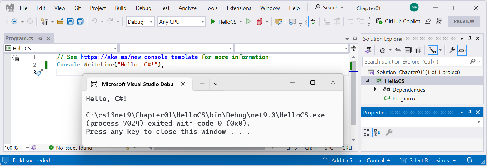

**Improvements** (3 items)

If you have suggestions for improvements, then please [raise an issue in this repository](https://github.com/markjprice/cs13net9/issues) or email me at markjprice (at) gmail.com.

- [Page 15 - Listing and removing versions of .NET](#page-15---listing-and-removing-versions-of-net)
- [Page 20 - Compiling and running code using Visual Studio](#page-20---compiling-and-running-code-using-visual-studio)
- [Appendix - Exercise 3.1 – Test your knowledge](#appendix---exercise-31--test-your-knowledge)

# Page 15 - Listing and removing versions of .NET

> Thanks to [s3ba-b](https://github.com/s3ba-b) who raised this [issue on November 5, 2024](https://github.com/markjprice/cs12dotnet8/issues/75).

In the first paragraph I wrote, ".NET runtime updates are compatible with a major version such as 8.x, and updated releases of the .NET SDK maintain the ability to build applications that target previous versions of the runtime, which enables the safe removal of older versions."

This could be clearer, so in the 10th edition*, I will write soemthing like: 

"All future versions of the .NET 10 runtime are compatible with its major version. For example, if a project targets `net10.0`, then you can upgrade the .NET runtime to future versions like `10.0.1`, `10.0.2`, and so on. In fact, you *must* upgrade the .NET runtime every month to maintain support."

"All future versions of the .NET SDK maintain the ability to build projects that target previous versions of the runtime. For example, if a project targets `net10.0` and you initially build it using .NET SDK `10.0.100`, then you can upgrade the .NET SDK to future bug fix versions like `10.0.101` or a major version like `11.0.100`, and that SDK can still build the project for the older targetted version. This means that you can safely remove all older versions of any .NET SDKs like `8.0.100`, `9.0.100`, or `10.0.100`, after you've installed a .NET SDK 11 or later. You will still be able to build all your old projects that target those older versions."

*It was too late to make this improvement in the 9th edition. 

# Page 20 - Compiling and running code using Visual Studio

> Thanks to Phil who sent an email on November 11, 2024, asking a question that prompted this improvement.

*Figure 1.5* shows the result of running the console app in Visual Studio, as shown in the following screenshot:

*Figure 1.5*

A reader completed this section but their command window looked different, as shown in the following screenshot:

Note that it would look more similar if the window was resized and the window was configured with different colors: black text on a white background instead of the opposite. 

> To change colors with this old command prompt app, click the top-left icon, and then in the menu, click **Properties**. You will see tabs to change **Colors**, **Font**, and so on.

You can also install and use alternative command prompts or terminals. For example, I installed **Windows Terminal** several years ago because it has several benefits:
- It makes it extra easy to change color schemes. For example, instead of the default white text on a black background, my publisher prefers black text on white background (at least in screenshots!) because they look better when printed in a book.
- It supports tabs so you can easily manage multiple active consoles simultaneously.
- It still uses the builtin `cmd.exe` so the output is the same as the default.

Since October 2022, Windows Terminal is the default in Windows 11 so you should not need to install it. But if you use an older version of Windows, then you can install Windows Terminal from the Microsoft Store. 

> **More Information**: You can learn more about Windows Terminal at the following link: https://devblogs.microsoft.com/commandline/windows-terminal-is-now-the-default-in-windows-11/.

In the next edition, I might add notes about this.

# Appendix - Exercise 3.1 – Test your knowledge

> Thanks to **rene**/`rene510` in the Discord channel for asking a question about this.

In Question 2, "What happens when you divide a double variable by 0?", in my suggested answer I wrote, "The `double` type contains a special value of `Infinity`. Instances of floating-point numbers can have the special values of `NaN` (not a number) or, in the case of dividing by `0`, either `PositiveInfinity` or `NegativeInfinity`."

In the next edition, I will add that those special values output as `8` and `-8`.
